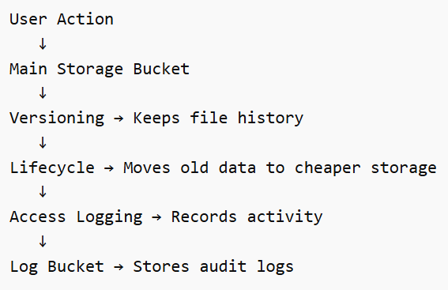
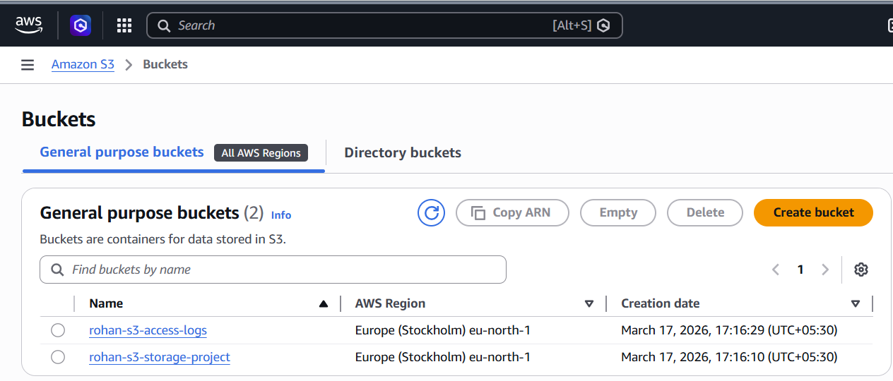
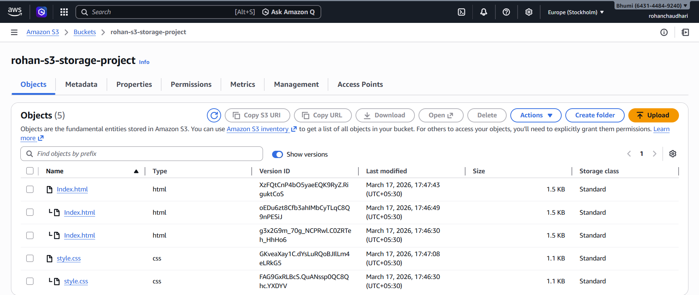
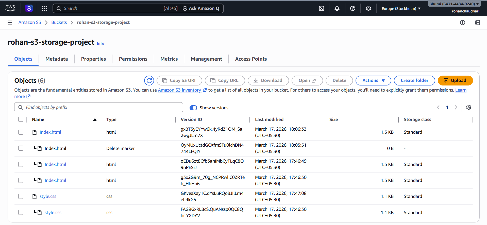
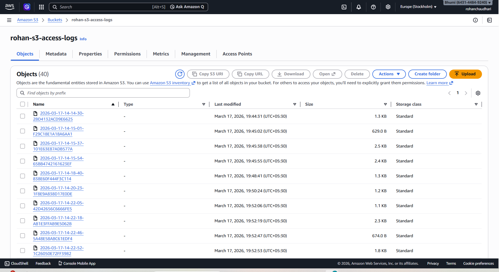
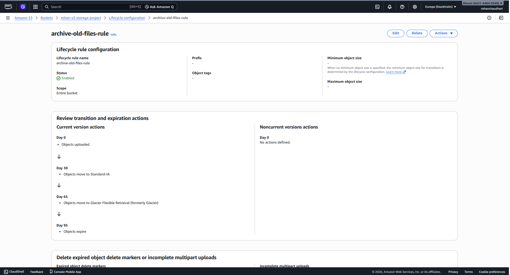

# Automating-S3-Storage-Management-using-Versioning-Lifecycle-and-Access-Logging

**Project Objective**
 • Prevent accidental data loss
 • Reduce long-term storage cost
 • Track file access activity

**Services Used**
🔹Amazon S3

Used for:
 • Object storage
 • File versioning
 • Lifecycle management
 • Access logging

⭐ **S3 Versioning**

Used for:
 • Maintaining file history
 • Recovering deleted or overwritten files

⭐ **S3 Lifecycle Policy**

Used for:
 • Automatic data archiving
 • Automatic deletion of old versions

⭐ **S3 Server Access Logging**

Used for:
 • Monitoring file access
 • Security auditing

**Real World Applications**
📁 Backup Storage Systems
📊 Log Management Systems
🌐 Website Hosting Storage
🔐 Security Monitoring
🏦 Compliance Requirements

**Architecture Flow**

Step 1 :
Two Amazon S3 buckets were created — one **main storage** bucket and one dedicated **logging** bucket.

The main bucket is used to store **application data**, while the log bucket is used to store access **logs generated**by the main bucket.

Step 2 :
Bucket versioning was **enabled** to maintain **multiple versions** of the same object.

Multiple uploads of the same file were performed to generate different versions.

Step 3 :
An older version of the uploaded file was **restored** by deleting the latest version and accessing the previous version.

Step 4 :
**Server access logging** was enabled on the main bucket, and logs were configured to be delivered to the logging bucket.

File upload and download operations were performed to generate access logs.

Step 5 :
**Lifecycle policies** were configured to automatically transition objects to **lower-cost storage** classes and **delete older versions** after a defined period.

